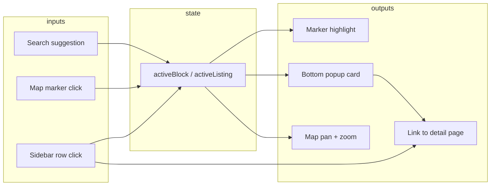

# Iteration 12.2 — Selection Flow Analysis

## Mode

READ-ONLY · interaction audit · no rollout

---

## State model

| State | Type | Scope | URL |
|---|---|---|---|
| `activeBlock` | `string \| null` (slug) | `RedesignMap` local | **No** |
| `activeListing` | `number \| null` | `RedesignMap` local | **No** |
| `filters` | `CatalogFilters` | local + URL | **Yes** |
| `region_id` | number | URL | **Yes** |
| `geo_*` | string | URL | **Yes** |

Selection is **ephemeral session state**. Refresh or share link loses active marker.

---

## Selection graph



---

## Path-by-path behavior

### 1. Sidebar row click

```typescript
onClick={() => setActiveBlock(c.slug === activeBlock ? null : c.slug)}
```

- Toggles selection (blocks) or toggle (listings: `l.id === activeListing ? null : l.id`)
- Row gets `border-primary bg-primary/5` highlight
- `MapSearch` receives `activeSlug={activeBlock}`
- Map: `useMapClusterLayer` selection effect → icon layout swap only
- Map: `useEffect` pans to coords at zoom **14** (blocks) / **15** (listings)
- Bottom popup renders with image, price, CTA link

**Constraint:** Item must exist in loaded 200-row array. Selecting off-page catalog item is impossible unless reached via search suggestion (still must be in loaded set).

### 2. Map marker click

```typescript
// blocks: clickMode 'select' — always sets id
// listings: clickMode 'toggle' — click again deselects
pm.events.add('click', () => onSelectRef.current?.(d.id));
```

- Updates same `activeBlock` / `activeListing` state
- Sidebar row highlight follows via prop equality check
- No scroll-into-view on sidebar — **selected row may be off-screen** in bottom panel

### 3. Search suggestion

```typescript
handleSuggestionSelect → setActiveBlock(suggestion.id) | setActiveListing(Number(id))
                       → handleFiltersChange({ search: suggestion.label })
```

- Sets search filter (URL + refetch)
- Sets active item simultaneously
- Refetch may reorder/replace 200-row set — active item could disappear if no longer in page 1

### 4. Popup dismiss

```typescript
onClick={() => onSelect?.(null)}
```

Clears selection; marker returns to default icon.

### 5. Detail navigation

Sidebar `Link to=/complex/{slug}` or `/listing/{id}` — separate navigation, selection state discarded on unmount.

---

## Cluster layer performance (selection)

`useMapClusterLayer` (Iter 2+ optimization):

| Event | Cluster rebuild? |
|---|---|
| Data change (200 rows) | **Yes** — signature change |
| Zoom mode change (dot ↔ label) | **Yes** — signature includes mode |
| Selection change | **No** — `applyPlacemarkActive` only |
| Pan/zoom (same data/mode) | **No** |

Measured expectation (Iter 11): sidebar clicks increment `selectionUpdates`, not `clusterRebuilds`.

---

## Viewport shadow layer interaction

When `viewport_shadow_render=1` (DEV):

| Layer | Interactivity | Selection |
|---|---|---|
| Legacy cluster | Full click | Drives `activeBlock` |
| Shadow cluster | `silent`, `pointer-events: none` | **None** |

Shadow green/orange dots never participate in selection. Correct for diff mode; if viewport becomes primary render source, selection must attach to viewport placemarks.

---

## Failure modes with viewport-driven future

| Scenario | Current behavior | Viewport risk |
|---|---|---|
| User pans away from selected item | Selection persists; marker still highlighted if in legacy 200 set | Selected item may leave viewport fetch set |
| Viewport returns item not in sidebar | N/A (shadow only) | Popup/sidebar mismatch |
| 200-cap: item on map (viewport) not in sidebar | Orange shadow dot only (DEV) | User sees marker, no sidebar row |
| Deep link `?block=slug` | **Not supported** | Needed for shareable selection |
| Mobile 40vh panel | No auto-scroll to active | Worse with dynamic viewport list |

---

## Recommended selection architecture (RFC, not implemented)

### Phase 1 — preserve legacy, add URL selection

```
?highlight={slug|listingId}
```

- Optional query param synced with `activeBlock` / `activeListing`
- On load: if highlight in current dataset → select; else fetch single-item detail for popup only

### Phase 2 — viewport dataset

```
Selection ID set ⊆ viewport fetch IDs
Sidebar scroll target = active ID
On pan: if active ID ∉ viewport response → keep popup, dim sidebar row as «вне области»
```

### Phase 3 — unified controller

Extract `useMapSelection()` hook:

```typescript
{
  activeId: string | null;
  source: 'sidebar' | 'map' | 'url' | 'search';
  select(id, source): void;
  clear(): void;
  isInViewport(id): boolean;
  isInSidebar(id): boolean;
}
```

Single owner in `RedesignMap`; map and sidebar remain presentational.

---

## URL sync recommendation

| Param | Purpose |
|---|---|
| Existing filter params | Unchanged |
| `highlight` | Selected block slug or listing id |
| `panel` | Mobile: `map` \| `list` (future) |

Do **not** encode bbox in URL for v1 — use map init + filter geo params only.

---

## Conclusion

Selection today is **simple, local, and tightly bound to the 200-row catalog slice**. It works for catalog-first UX but breaks down when:

1. Map shows viewport-visible objects not in sidebar
2. User expects pan to update list
3. Share/deep-link of selected marker is needed

Viewport rollout requires a **selection controller** that understands viewport membership, not just prop drilling through `activeSlug`.
