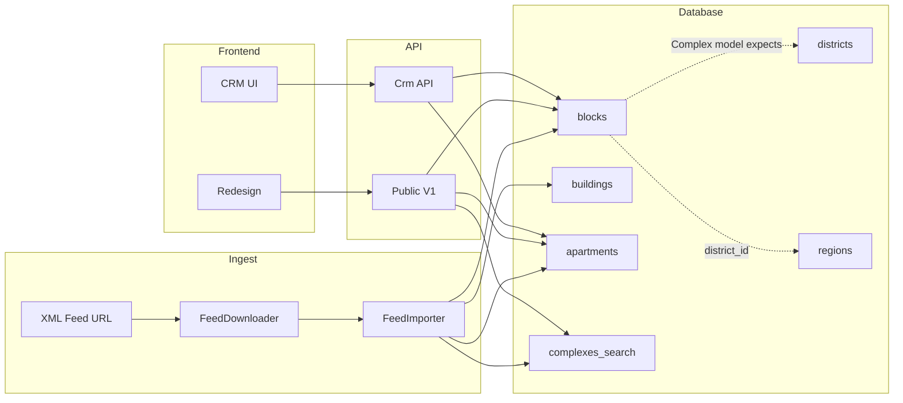

# STEP 6 — Data flow (feed → DB → API → frontend)

**Audit date:** 2026-03-23

---

## 6.1 Diagram (conceptual)

---

## 6.2 Feed pipeline

1. **Download:** `FeedDownloadCommand` / CRM `POST /feed/download` → `FeedDownloader` writes temp file.
2. **Import:** `POST /feed/sync` or command → `FeedImporter` parses XML, upserts blocks/buildings/apartments.
3. **Locks:** Apartment `locked_fields` + CRM lock/unlock prevent overwriting manual fields.
4. **Search index:** Importer and/or `SyncComplexesSearchCommand` should refresh **`complexes_search`** — if skipped, map/search APIs under-deliver.

---

## 6.3 Read path (public site)

1. **Complexes list:** `ComplexController@index` / `SearchService` → `blocks` (+ joins).
2. **Complex detail + apartments:** `ComplexController@show` / `apartments` sub-resource.
3. **Apartments (broken):** `GET /api/v1/apartments` intended as catalog-wide list — **controller missing `index`**.
4. **Apartment card page:** API `GET /api/v1/apartments/{slug}` exists but **redesign apartment page uses mocks**.
5. **Map:** `MapController@complexes` → **`complexes_search`** (not raw blocks scan).

---

## 6.4 CRM write path

1. User edits complex/apartment → `PUT /api/v1/crm/...`
2. Models fire **`LogsChanges`** / observers for history.
3. Feed next run may update non-locked fields.

---

## 6.5 Known breaks in the pipeline

| Stage | Symptom | Likely cause |
|-------|---------|--------------|
| Filters API | `districts: []` | `district_id` → `regions` vs `District` model / empty `districts` |
| Map / search API | Empty markers / zero results | `complexes_search` empty or not synced |
| Apartments list API | HTTP 500 | No `ApartmentController::index` |
| Public apartment page | Wrong data | Mock instead of API |

---

## 6.6 Recommendations

1. After every bulk import: run **search sync** command (document in runbook).
2. Fix **district** model vs FK once; backfill `districts` or migrate FK to `districts`.
3. Replace **mock** apartment page with `fetchApartmentBySlug` (or equivalent) when API stable.
4. Add monitoring: **health**, **filters count**, **map payload size**, **500 rate** on `/apartments`.
